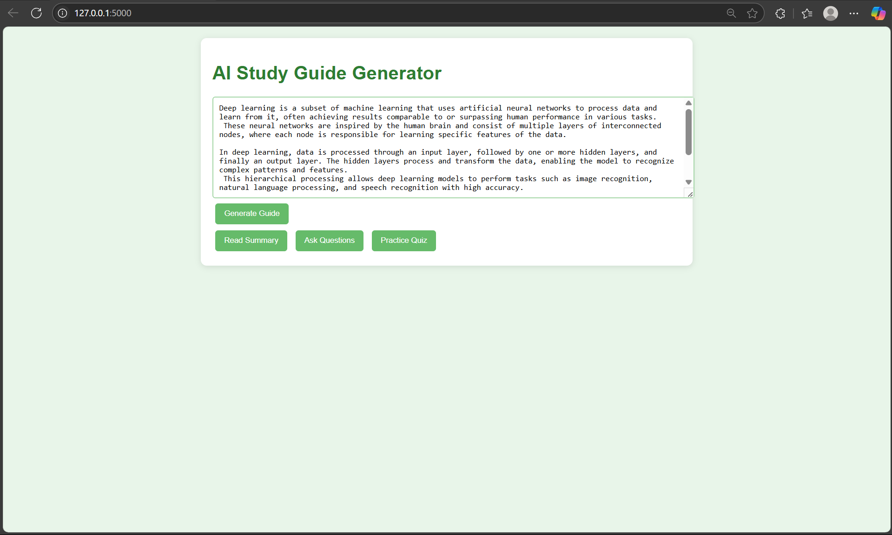

Here is your improved, professional, and minimal `README.md` — with no extra explanations or fluff:

---

```markdown
# 📚 AI Study Helper

A web-based study assistant that allows users to:
- Summarize large blocks of learning material
- Generate quizzes with MCQs and explanations
- Ask context-based questions and receive answers

Built using Hugging Face Transformers with a Flask backend and an interactive HTML/JS frontend.

---

## ⚙️ Technology Stack

- **Backend**: Python, Flask
- **Frontend**: HTML, CSS, JavaScript
- **NLP Models**:
  - `facebook/bart-large-cnn` (Text Summarization)
  - `bert-large-uncased-whole-word-masking-finetuned-squad` (Question Answering)
- **Libraries**:
  - `transformers`
  - `torch`
  - `flask`
  - `random` (for quiz generation)

---

## 📁 File Structure

```

ai-study-helper/
│
├── app.py                  # Main Flask application
├── requirements.txt        # Python dependencies
│
├── templates/
│   ├── index.html          # Main interface
│   └── result.html         # Study guide result page (optional)
│
├── static/
│   ├── style.css           # Custom styles
│   └── app.js              # Frontend logic
│
└── README.md               # Project documentation

````

---

## 💻 Setup Instructions

### 1. Clone the repository

```bash
git clone https://github.com/yourusername/ai-study-helper.git
cd ai-study-helper
````

### 2. Create a virtual environment (optional but recommended)

```bash
python -m venv venv
source venv/bin/activate         # On Windows: venv\Scripts\activate
```

### 3. Install dependencies

```bash
pip install -r requirements.txt
```

**`requirements.txt`:**

```txt
flask
transformers
torch
```

---

## ▶️ Running the App

```bash
python app.py
```

Then open your browser and go to:

```
http://127.0.0.1:5000
```
## 📸 Screenshots

### 📝 interface


---

## 🧠 Use Cases

* Students revising large notes
* Teachers creating quizzes from content
* Study platforms offering AI assistance
* Personal learning automation

---

## 📜 License

MIT

---

## 📬 Contact

[LinkedIn](https://www.linkedin.com/in/poojith-inavolu-469320277/)
